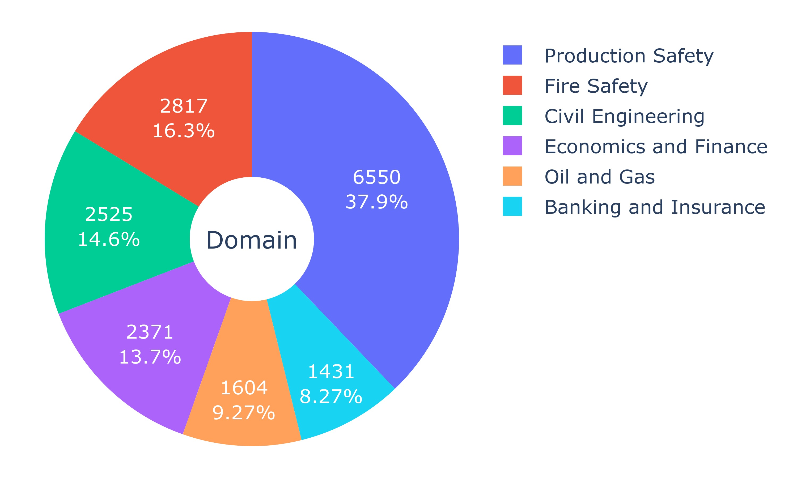
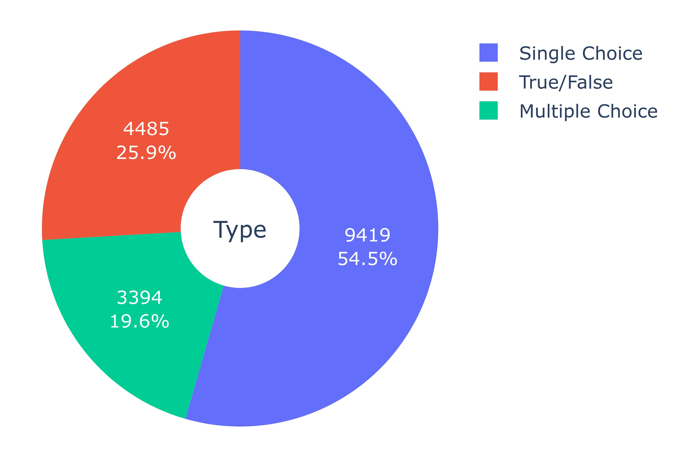

<div align="center">
  <a href="https://swarms.world">
    <h1>QualBench💯</h1>
  </a>
</div>
<p align="center">
  <em>Benchmarking Chinese LLMs with Localized Qualification Benchmark</em>
</p>

---

Qualification examinations in China are standardized, expert-verified tests designed to certify professionals across various domains, ensuring they meet industry and regulatory standards. These exams serve as critical gateways for workforce entry, offering a reliable framework for evaluating the domain-specific knowledge of LLMs in real-world applications.

We propose Qualification Benchmark (**QualBench**), a pioneering multi-domain Chinese QA benchmark designed to evaluate the performance of LLMs in localized Chinese context. Comprising 17,298 expert-verified questions sourced from 26 professional qualification examinations in China, the dataset addresses the gap in existing benchmarks, which often lack coverage of diverse vertical domains and fail to account for China-specific knowledge requirements.

<div style="font-size: 80%;">

| Dataset | Source Qualification Exam | Size | Best Model | Vertical Domain | Localization | Explainable |
|---|---------------------------------------------------------------|--------|------------|----------------|--------------|-------------|
| [GAOKAO-Bench](https://github.com/OpenLMLab/GAOKAO-Bench) | Chinese College Entrance Examination (Gaokao) | 2,811 | GPT-4 | ❌ | ✅ | ❌ |
| [CFLUE](https://github.com/aliyun/cflue) | Finance Qualification Exams | 38,636 | Qwen-72B | Finance | ❌ | ✅ |
| [M3KE](https://github.com/tjunlp-lab/M3KE) | Entrance Exams of Different Education Levels | 20,477 | GPT-3.5 | ❌ | ✅ | ❌ |
| [FinEval](https://github.com/SUFE-AIFLM-Lab/FinEval) | Finance Qualification Exams | 8,351 | GPT-4o | Finance | ❌ | ❌ |
| [CMExam](https://github.com/williamliujl/CMExam) | Chinese National Medical Licensing Exam | 68,119 | GPT-4 | Medical | ❌ | ❌ |
| [LogiQA](https://github.com/lgw863/LogiQA-dataset) | Civil Servants Exams of China | 8,678 | RoBERTa | ❌ | ✅ | ✅ |
| **QualBench (ours)** | Multiple Sources | 17,316 | Qwen-7B | Multiple | ✅ | ✅ |

</div>

## Dataset Statistics

<div style="display: flex; align-items: flex-start; gap: 20px; max-width: 800px; margin: 0 auto; justify-content: center;">
  <div style="font-size: 80%;">
    <table>
      <tr>
        <th><strong>Category</strong></th>
        <th><strong>Number of Questions</strong></th>
      </tr>
      <tr>
        <td>Production Safety (安全生产)</td>
        <td>6550</td>
      </tr>
      <tr>
        <td>Fire Safety (消防安全)</td>
        <td>2817</td>
      </tr>
      <tr>
        <td>Civil Engineering (建筑工程)</td>
        <td>2525</td>
      </tr>
      <tr>
        <td>Economics and Finance (经济金融)</td>
        <td>2371</td>
      </tr>
      <tr>
        <td>Oil and Gas (石油天然气)</td>
        <td>1604</td>
      </tr>
      <tr>
        <td>Banking and Insurance (银行保险)</td>
        <td>1431</td>
      </tr>
      <tr>
        <td><strong>Total</strong></td>
        <td>17,298</td>
      </tr>
    </table>
  </div>
  <div style="display: flex; flex-direction: column; gap: 10px;">
    <div>
      
      
    </div>
  </div>

</div>

## How to use QualBench

Load the data using Python's built-in `json` package as shown below:
```python
import json

file_path = "./QualBench_dataset.json"

with open(file_path, "r", encoding="utf8") as f:
    datas = json.load(f)
  
print(datas[0])

"""
{'idx': 0,
 'question_type': '单选题',
 'domain': '安全生产',
 'question': '机械设备运动部分是最危险的部位，尤其是那些操作人员易接触的零部件，下列针对不同机械设备转动部位的危险所采取的安全防护措施中，正确的是（）。\nA．针对轧钢机，在验式机轴处采用锥形防护罩防护\nB．针对辊式输送机，在驱动轴上游安装防护罩防护\nC．针对啮合齿轮，齿轮转动机构采用半封闭防护\nD．针对手持式砂轮机，在磨削区采用局部防护',
 'answer': 'A',
 'explanation': 'B项，辊式输送机应该在驱动轴的下游安装防护罩。'}
"""
```

A complete code implementation is provided in `./test_gpt4o.py`.

## Evaluation Results
The benchmark evaluates five state-of-the-art Chinese LLMs (e.g., Qwen2.5, ChatGLM3) alongside non-Chinese models (e.g., GPT-4o, LLama-7B) in a one-shot setting. Results demonstrate that Chinese LLMs, particularly Qwen2.5, consistently outperform non-Chinese counterparts, highlighting the dataset’s superiority in differentiating model capabilities in China-specific applications and emphasize the significant advantages of Chinese LLMs in applications under the Chinese context.


